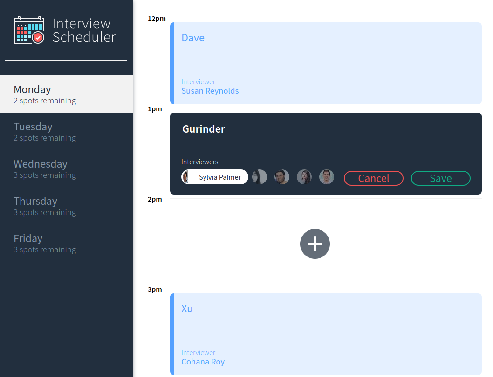

# Interview Scheduler

## Setup

Install dependencies with `npm install`.

### Running Webpack Development Server

```sh
npm start
```

### Running Jest Test Framework

```sh
npm test
```

### Running Storybook Visual Testbed

```sh
npm run storybook
```

### Connecting to the app

Once the Webpack Development Server is running, navigate to `http://localhost:8000`

## Description

*Scheduler* is a React app that schedules, modifies and manages appointments.

## Sample


